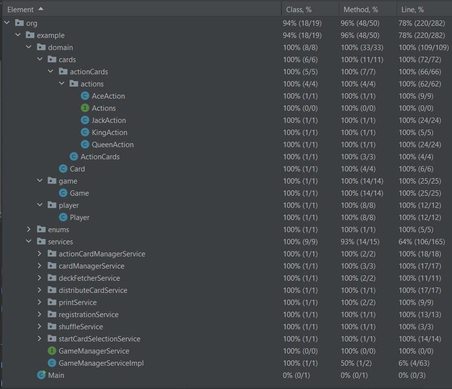

# CardGame
## Instructions
- Install Java (version 11.0.18)
- Install Maven (version 3.9.0)
- Unzip the provided zip folder into desired location
- Open the folder in any IDE like IntelliJ IDEA or Eclipse

### To run all the Test Case
- Go to **"src -> test -> java"**
- Right click on the folder and click **"Run All Tests"**

### To see the output
- Go to **"src -> main -> java -> org -> example -> Main.java"**
- Right click on Main.java and click **"Run main.main()"**

## Test Coverage Report

